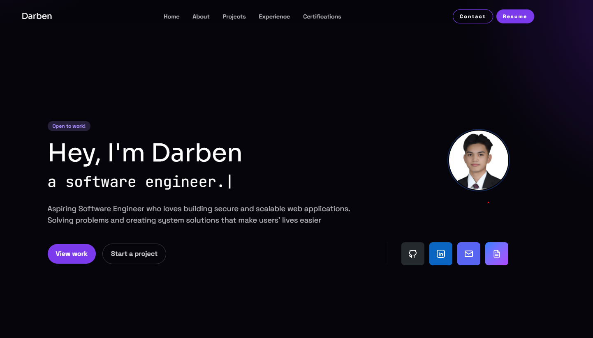

# Portfolio Website

Personal portfolio website built with React and Vite. It highlights projects, certifications, experience, and contact links.

## Live Demo

- [Add live URL]

## Preview



## Features

- Project and certification galleries
- Experience timeline and skills overview
- Smooth section navigation
- Scroll-based animations
- Responsive layout

## Tech Stack

- React 19
- Vite 7
- Tailwind CSS 4
- React Router
- AOS (Animate On Scroll)
- React Scroll
- React Icons

## Getting Started

Install dependencies:

```bash
npm install
```

Run the dev server:

```bash
npm run dev
```

Build for production:

```bash
npm run build
```

Preview the production build:

```bash
npm run preview
```

## Project Structure

```
public/
src/
  assets/
  components/
    cards/
  data/
  layouts/
  pages/
  App.jsx
  App.css
  index.css
  main.jsx
```

## Content Management

- Data lives in src/data as JSON.
- Pages are in src/pages and composed with layouts from src/layouts.
- Card components live in src/components/cards.

## Configuration Notes

- AOS is initialized in src/App.jsx.
- Section navigation uses React Scroll.

## Deployment

- Build output is in dist/.
- Deploy with any static host (Netlify, Vercel, GitHub Pages).

## License

All rights reserved.
